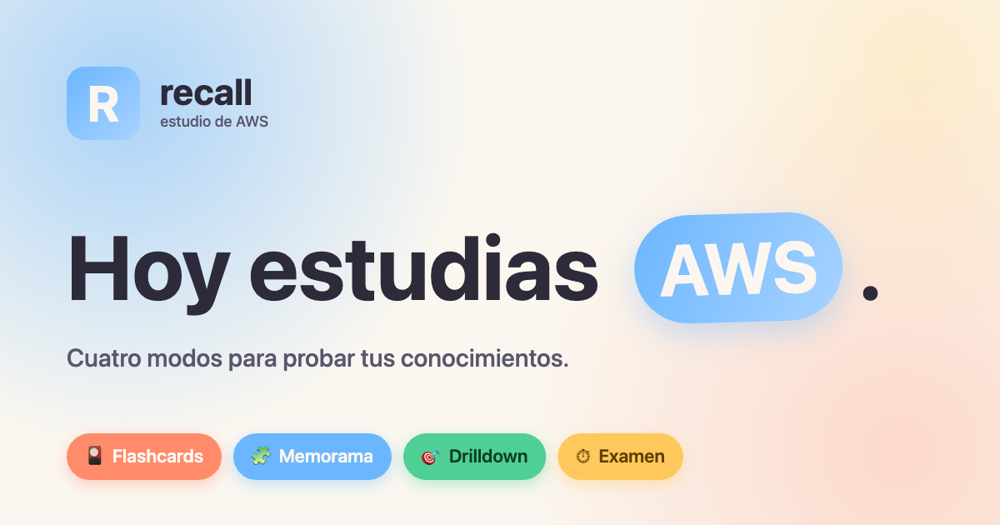
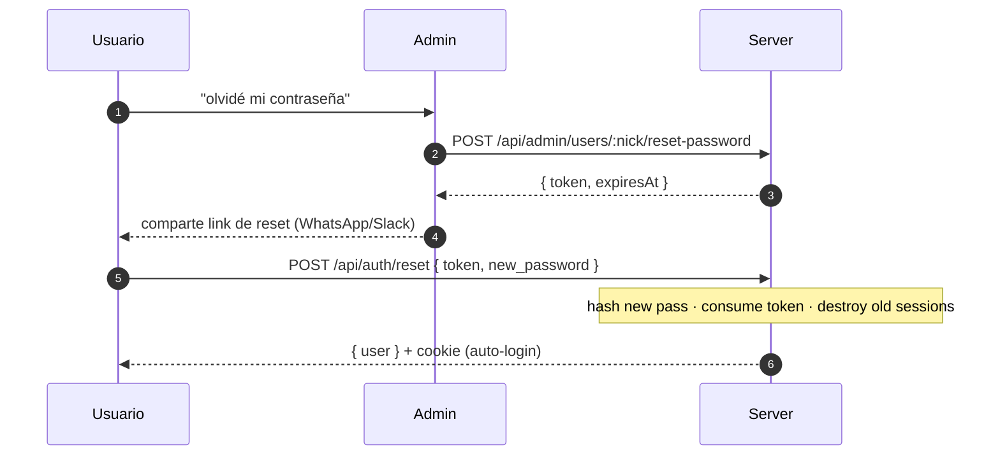

<div align="center">



# 🎴 Recall · AWS Study Cards

**App web multi-usuario para estudiar AWS con tu grupo de clase.**
Cuatro modos de juego, repetición espaciada Leitner, perfiles con foto,
comparación de progreso, leaderboard, feed de actividad, recuperación de
contraseña asistida por admin y deploy con un solo comando.


</div>

---

## 📑 Índice

- [Demo rápida](#-demo-rápida)
- [Features](#-features)
- [Tech stack](#-tech-stack)
- [Quick start](#-quick-start)
- [Producción con Docker](#-producción-con-docker)
- [Variables de entorno](#-variables-de-entorno)
- [Estructura del proyecto](#-estructura-del-proyecto)
- [API REST](#-api-rest)
- [Modelo de datos](#-modelo-de-datos)
- [Recuperación de contraseña](#-recuperación-de-contraseña)
- [Modos de juego — detalle](#-modos-de-juego--detalle)
- [Stats dashboard](#-stats-dashboard)
- [Personalización](#-personalización)
- [Catálogo curado](#-catálogo-curado)
- [Íconos oficiales de AWS](#-íconos-oficiales-de-aws)
- [Persistencia](#-persistencia)
- [Agregar servicios o features](#-agregar-servicios-o-features)
- [Licencia y atribución](#-licencia-y-atribución)

---

## 🎬 Demo rápida

```text
recall.tu-dominio.com/login    → entrar con apodo + contraseña
                       /register → registrarse con invite code
                       /forgot   → instrucciones de recuperación
                       /reset    → setear nueva contraseña con token de admin
                       /         → 4 mode tiles + continue bar + dash row
                       /flashcards/play  → Leitner 5 cajas, espacio voltea, J/K responde
                       /memorama/play    → tableros 6/8/12/18 con cronómetro
                       /drilldown/play/:parent → MC con distractores hermanos
                       /exam/play        → timer regresivo, q-dots, pass/fail
                       /stats            → distribución Leitner + heat strip + history
                       /miembros         → grid de clase con foto + racha + last seen
                       /u/:nick          → perfil público con heatmap 28d
                       /compare/:a/:b    → cara a cara con ganador por fila
                       /leaderboard      → rankings por modo
                       /feed             → actividad reciente de la clase
                       /ajustes          → apariencia (6 acentos + 4 fuentes), perfil, contraseña
                       /admin            → invite codes + miembros + reset de contraseñas
```

---

## ✨ Features

### 🎮 Cuatro modos de juego

| Modo | Mecánica | Variantes |
|---|---|---|
| **Flashcards** | Leitner 5 cajas, muestreo ponderado, atajos `Space` / `J` / `K` | acrónimo ↔ nombre, servicio → descripción, caso de uso → servicio, ícono → nombre, servicio → relacionados |
| **Memorama** | Tableros **6 / 8 / 12 / 18** pares, cronómetro opcional, récords | ícono ↔ nombre, acrónimo ↔ nombre completo, servicio ↔ caso de uso, servicio ↔ categoría |
| **Drilldown** | Discriminación de features dentro de un padre — distractores hermanos | 4 opciones A/B/C/D con feedback inmediato (`matchPop`/`shake`) |
| **Examen** | Simulación contra reloj, umbral **70 %**, revisión con explicación | 4 variantes flashcard-MC + drilldown-MC, mix `flashcards / mixed 70-30 / drilldown` |

### 👥 Multi-usuario y social

- 🔐 **Registro cerrado** con invite codes (admin genera, los demás se unen)
- 👤 **Perfiles** con nombre completo, apodo único, foto (resize automático a 256×256 webp)
- ✏️ **Edición de perfil y cambio de contraseña** in-app desde `/ajustes`
- 🆘 **Recuperación de contraseña asistida por admin** con tokens de un solo uso (TTL 24h) — sin necesidad de email ni SMTP
- 🏆 **Leaderboards** por modo (cartas dominadas, % drilldown, exámenes aprobados, partidas de memorama)
- 🤝 **Comparación 1-a-1** entre dos usuarios con ganador resaltado por fila
- 📅 **Heatmap de actividad** tipo GitHub (últimos 28 días)
- 🔥 **Streak** (días consecutivos) calculada server-side desde múltiples fuentes
- 📰 **Feed** con actividad reciente de toda la clase (cartas dominadas, exámenes, récords)
- 👁️ **Last seen** en lista de miembros con throttle de 60 s
- 📷 **Open Graph + Twitter Card** preconfiguradas — preview decente al compartir el link en WhatsApp/Slack/Discord

### 🎨 Personalización por usuario

- 🌗 Tema **light / dark** (preferencia local del dispositivo)
- 🎨 **6 acentos** curados con contraste preservado en ambos temas
- ✍️ **4 pares tipográficos**: DM Sans, Plus Jakarta, Quicksand, **OpenDyslexic**
- ♿ **OpenDyslexic** servida vía jsdelivr — opción específicamente diseñada para dislexia
- 💾 Persistencia por **usuario** (sincronizada entre dispositivos vía `user_configs`)

### 📊 Stats dashboard

- Distribución Leitner con barras de color por caja
- Top servicios y features para repasar
- Dominio por categoría y por servicio padre
- Histórico de exámenes con pass/fail
- Reset granular por sección con confirmación

---

## 🧱 Tech stack

<table>
<tr>
<td valign="top" width="33%">

### Frontend


- `tsc -b` estricto
- React Router 6 (`BrowserRouter`)
- Sin librerías de UI — `styles.css` propio
- Cache en memoria + queue async
- Firmas sync preservadas en las vistas

</td>
<td valign="top" width="33%">

### Backend


- `better-sqlite3` con WAL + foreign keys
- Cookie `httpOnly` + sesión en DB
- `bcryptjs` cost 12 (sin JWT)
- `sharp` resize 256×256 webp
- Sirve también el SPA

</td>
<td valign="top" width="33%">

### Deploy


- Imagen única (front + API)
- 2 servicios: `app` + `caddy`
- Volúmenes `db_data` + `uploads`
- TLS automático con tu dominio
- Healthcheck integrado

</td>
</tr>
</table>

---

## 🚀 Quick start

### Desarrollo local (sin Docker)

Necesitas Node 20+ y npm 10+.

```bash
# 1) Instala dependencias en ambos lados
npm install
( cd server && npm install )

# 2) Levanta el backend (terminal 1)
cd server
BOOTSTRAP_INVITE=FIRSTRUN COOKIE_SECRET="$(openssl rand -hex 32)" npm run dev
# → Fastify escuchando en http://localhost:8080

# 3) Levanta el frontend (terminal 2)
npm run dev
# → Vite en http://localhost:5173, proxy /api y /uploads → :8080
```

Abre **http://localhost:5173/register**, registra con el invite `FIRSTRUN` y quedas como admin.

#### Scripts disponibles

| Lugar | Script | Hace |
|---|---|---|
| raíz | `npm run dev` | Vite dev server con HMR |
| raíz | `npm run build` | `tsc -b && vite build` → `dist/` |
| raíz | `npm run typecheck` | `tsc -b --noEmit` |
| raíz | `npm run preview` | Sirve el build de producción |
| `server/` | `npm run dev` | `tsx watch` con auto-reload |
| `server/` | `npm run build` | `tsc` → `server/dist/` |
| `server/` | `npm start` | `node dist/index.js` (usa el build) |
| `server/` | `npm run typecheck` | `tsc --noEmit` |

---

## 🐳 Producción con Docker

La app se empaqueta en una imagen multi-stage (Node 20 bookworm-slim) que sirve
**tanto el SPA como la API** en `:8080`. Caddy va delante para terminar TLS contra
tu dominio.


### Deploy en 3 comandos

```bash
cp .env.example .env
# edita DOMAIN, COOKIE_SECRET (openssl rand -hex 32) y BOOTSTRAP_INVITE
docker compose up -d --build
```

Caddy obtiene certificado Let's Encrypt automáticamente cuando el DNS apunta al
host (TCP 80 + 443 expuestos). Para pruebas locales puedes poner `DOMAIN=localhost`
— Caddy emite un certificado interno (acepta el warning del navegador).

### Servicios y volúmenes

```
┌────────────────────┐     ┌─────────────────────────┐
│  Caddy :80/:443    │ ───▶│  app :8080  (Fastify)   │
│  Let's Encrypt TLS │     │  - /api/*               │
│  reverse_proxy     │     │  - /uploads/*           │
└────────────────────┘     │  - SPA fallback         │
                           └─────┬───────────────┬───┘
                                 │               │
                          vol: db_data    vol: uploads
                          recall.db       avatars/*.webp
```

| Volumen | Contenido | Sobrevive `down`/`up` |
|---|---|:---:|
| `db_data` | `recall.db` + `recall.db-wal` + `recall.db-shm` | ✅ |
| `uploads` | `avatars/<userId>.webp` | ✅ |
| `caddy_data` | certificados + ACME state | ✅ |
| `caddy_config` | runtime config | ✅ |

### Backup en caliente

```bash
docker run --rm \
  -v aws-recall_db_data:/data -v "$PWD":/out \
  alpine cp /data/recall.db /out/recall-$(date +%F).db
```

> 💡 SQLite con WAL permite COPY consistente sin parar la app, siempre que copies
> también `recall.db-wal` si vas a restaurar en caliente.

### Logs y mantenimiento

```bash
docker compose logs -f app caddy   # streaming
docker compose restart app          # rebuild rápido
docker compose down                 # detiene pero mantiene volúmenes
docker compose down -v              # ⚠️ destruye datos
```

### Sin Caddy

Si ya tienes nginx / Traefik / un load balancer delante, elimina el servicio
`caddy` del `docker-compose.yml` y publica directo `app:8080`. Asegúrate de
mandar `X-Forwarded-Proto: https` y respetar la cookie `Secure` cuando termines
TLS arriba.

---

## 🔧 Variables de entorno

| Variable | Default | Uso |
|---|---|---|
| `PORT` | `8080` | Puerto HTTP del backend |
| `HOST` | `0.0.0.0` | Bind address |
| `DB_PATH` | `server/data/recall.db` | Ruta del archivo SQLite |
| `UPLOADS_DIR` | `server/data/uploads` | Carpeta para avatares |
| `PUBLIC_DIR` | `server/public` | Estáticos del frontend (solo prod) |
| `COOKIE_SECRET` | dev fallback | **Obligatorio en prod**. `openssl rand -hex 32` |
| `BOOTSTRAP_INVITE` | _(vacío)_ | Si está set y no hay usuarios, se siembra como invite. El primer registro queda como admin |
| `NODE_ENV` | _(vacío)_ | `production` activa cookies `Secure`, logs no-debug |

Ejemplo de `.env.example`:

```bash
DOMAIN=recall.example.com
COOKIE_SECRET=replace_me_with_openssl_rand_hex_32
BOOTSTRAP_INVITE=FIRSTRUN
```

---

## 📁 Estructura del proyecto

```
.
├── data/                          ← catálogo curado de AWS (no DB)
│   ├── services.json              ← 181 servicios con features para Drilldown
│   └── categories.json            ← 17 categorías con color oficial AWS
│
├── src/                           ← frontend (Vite + React + TS)
│   ├── App.tsx                    ← rutas (con ProtectedRoute)
│   ├── main.tsx                   ← monta AuthProvider + aplica apariencia
│   ├── styles.css                 ← sistema visual completo (~1500 líneas)
│   │
│   ├── lib/
│   │   ├── types.ts               ← Service, ServiceFeature, ExamConfig…
│   │   ├── data.ts                ← getters, filterServices
│   │   ├── deck-builder.ts        ← mazos de flashcards
│   │   ├── board-builder.ts       ← tableros de memorama
│   │   ├── drilldown.ts           ← generador MC
│   │   ├── exam.ts                ← generador MC mixto
│   │   ├── spaced-rep.ts          ← Leitner 5 cajas + muestreo ponderado
│   │   ├── stats.ts               ← agregaciones del dashboard
│   │   ├── shuffle.ts
│   │   ├── api.ts                 ← fetch wrapper con credentials + 401 handling
│   │   ├── write-queue.ts         ← cola con coalescing + retry + sendBeacon
│   │   ├── progress-store.ts      ← cache + queue, firmas sync
│   │   ├── auth-context.tsx       ← AuthProvider + useAuth()
│   │   ├── social-api.ts          ← wrappers de endpoints sociales
│   │   ├── theme-presets.ts       ← 6 acentos + 4 fuentes + applyAppearance()
│   │   └── format.ts              ← formatRelative / formatTimeMs / formatPercent
│   │
│   ├── components/
│   │   ├── AppShell.tsx           ← Topbar + menú con avatar + nav social
│   │   ├── ProtectedRoute.tsx     ← redirige a /login si no hay sesión
│   │   ├── PhotoUpload.tsx        ← <Avatar> + uploader 256×256 webp
│   │   ├── FiltersControl.tsx     ← chips de tier + categoría con contador
│   │   └── ServiceIcon.tsx        ←  con fallback a placeholder
│   │
│   └── views/
│       ├── Home.tsx               ← hero + continue-bar + mode tiles
│       ├── Login.tsx, Register.tsx
│       ├── Forgot.tsx             ← /forgot — instrucciones de recuperación
│       ├── Reset.tsx              ← /reset?token=… — set nueva contraseña + auto-login
│       ├── FlashcardSetup.tsx, FlashcardSession.tsx
│       ├── MemoramaSetup.tsx,   MemoramaBoard.tsx
│       ├── DrilldownSetup.tsx,  DrilldownSession.tsx
│       ├── ExamSetup.tsx,       ExamSession.tsx
│       ├── StatsDashboard.tsx
│       ├── Members.tsx            ← grid de clase con foto + racha + last seen
│       ├── PublicProfile.tsx      ← /u/:nick — stats + heatmap 28d
│       ├── Compare.tsx            ← /compare/:a/:b — cara a cara
│       ├── Leaderboard.tsx        ← rankings por modo
│       ├── Feed.tsx               ← actividad reciente de la clase
│       ├── Admin.tsx              ← invites + miembros + botón resetear contraseña
│       └── Settings.tsx           ← /ajustes — apariencia + perfil + contraseña
│
├── server/                        ← backend (Fastify + better-sqlite3)
│   ├── package.json
│   ├── tsconfig.json
│   └── src/
│       ├── index.ts               ← Fastify, routes, SPA fallback
│       ├── env.ts                 ← config por env vars
│       ├── db.ts                  ← better-sqlite3 + migración + bootstrap invite
│       ├── auth.ts                ← bcrypt + sesiones + requireAuth/Admin
│       ├── validation.ts          ← ApiError + validadores
│       ├── types.ts               ← UserRow, SessionRow, InviteRow…
│       ├── schema.sql             ← 10 tablas
│       └── routes/
│           ├── auth.ts            ← /api/auth/* (login, register, reset, me…)
│           ├── me.ts              ← /api/me/{profile,photo,password}
│           ├── admin.ts           ← /api/admin/{invites,users,users/:nick/reset-password}
│           ├── progress.ts        ← flashcards/drilldown/memorama/exam/config + DELETEs
│           └── social.ts          ← /api/users, /:nick, /compare, /leaderboard, /feed
│
├── public/
│   ├── icons/                     ← 181 SVGs oficiales + icon-map.md
│   ├── og.png                     ← Open Graph 1200×630 (preview en chats)
│   ├── favicon.svg
│   └── Asset-Package_07312025…/   ← paquete oficial extraído
│
├── scripts/
│   ├── gen-icon-map.mjs           ← regenera public/icons/icon-map.md
│   └── install-icons.mjs          ← copia los SVGs desde el paquete oficial
│
├── Dockerfile                     ← multi-stage: frontend + backend + runtime
├── docker-compose.yml             ← servicios app + caddy + volúmenes
├── Caddyfile                      ← reverse proxy + TLS automático
├── .env.example                   ← variables que debes editar antes de up
├── .dockerignore
└── README.md
```

---

## 🛣️ API REST

Todos los endpoints excepto `/api/health`, `/api/auth/login`, `/api/auth/register`,
`/api/auth/bootstrap-status` y `/api/auth/reset` (GET y POST) requieren una
cookie de sesión válida.

### Auth

| Método | Ruta | Body | Respuesta |
|---|---|---|---|
| `POST` | `/api/auth/register` | `{invite_code, nickname, full_name, password}` | `{user}` + cookie |
| `POST` | `/api/auth/login` | `{nickname, password}` | `{user}` + cookie |
| `POST` | `/api/auth/logout` | — | `{ok}` + cookie cleared |
| `GET`  | `/api/auth/me` | — | `{user}` (401 si no hay sesión) |
| `GET`  | `/api/auth/bootstrap-status` | — | `{hasUsers}` |
| `GET`  | `/api/auth/reset?token=…` | — | `{ok, nickname, fullName, expiresAt}` o 400 |
| `POST` | `/api/auth/reset` | `{token, new_password}` | `{user}` + cookie (auto-login). Destruye sesiones viejas del user |

### Perfil propio (`/me`)

| Método | Ruta | Body | Respuesta |
|---|---|---|---|
| `PATCH` | `/api/me/profile` | `{full_name?}` | `{user}` |
| `POST`  | `/api/me/photo` | multipart `file` (≤5MB) | `{user}` con `photoUrl` |
| `DELETE`| `/api/me/photo` | — | `{user}` |
| `PUT`   | `/api/me/password` | `{old, new}` | `{ok, reauth: true}` |

### Admin (`is_admin = 1`)

| Método | Ruta | Body | Respuesta |
|---|---|---|---|
| `GET`    | `/api/admin/invites` | — | `{invites: [...]}` |
| `POST`   | `/api/admin/invites` | `{count?: 1-20, ttl_days?: 1-365}` | `{codes: [...]}` |
| `DELETE` | `/api/admin/invites/:code` | — | `{ok}` o 400 si ya usado |
| `GET`    | `/api/admin/users` | — | `{users: [...]}` |
| `POST`   | `/api/admin/users/:nickname/reset-password` | — | `{token, expiresAt, targetNickname, targetFullName}`. Rechaza self-reset con 400 |

### Progreso

| Método | Ruta | Cuerpo / Respuesta |
|---|---|---|
| `GET` | `/api/progress/flashcards` | `Record<cardId, CardProgress>` |
| `PATCH` | `/api/progress/flashcards` | upsert parcial; detecta tránsito a box 5 → log `card_mastered` |
| `DELETE` | `/api/progress/flashcards` | resetea progreso del user |
| `GET` | `/api/progress/drilldown` | `Record<featureId, DrilldownFeatureProgress>` |
| `POST` | `/api/progress/drilldown/answer` | `{featureId, correct}` |
| `DELETE` | `/api/progress/drilldown` | reset |
| `GET` | `/api/memorama/stats` | `MemoramaStats` |
| `POST` | `/api/memorama/game` | `{pairs, moves, timeMs}` → calcula records + log `memo_record` |
| `DELETE` | `/api/memorama/stats` | reset |
| `GET` | `/api/exam/attempts` | array (cap 50) |
| `POST` | `/api/exam/attempts` | `ExamAttempt` + log `exam_passed`/`exam_failed` |
| `DELETE` | `/api/exam/attempts` | reset |

### Configs por usuario

| Método | Ruta | Body |
|---|---|---|
| `GET` | `/api/config/:kind` | `{value: T \| null}` |
| `PUT` | `/api/config/:kind` | JSON arbitrario |

`:kind ∈ { flashcard, memorama, exam, filters, theme, appearance }`

### Social

| Método | Ruta | Respuesta |
|---|---|---|
| `GET` | `/api/users` | `{users: [...]}` con `streak` por user |
| `GET` | `/api/users/:nickname` | `{user, stats, streak, heatmap28}` |
| `GET` | `/api/compare?a=&b=` | `{a, b}` lado a lado |
| `GET` | `/api/leaderboard?mode=` | `mode ∈ flashcards \| memorama \| drilldown \| exams` |
| `GET` | `/api/feed?limit=` | `{events: [...]}` con user info inline |

### Health

| Método | Ruta | Respuesta |
|---|---|---|
| `GET` | `/api/health` | `{ok: true, ts}` (usado por el HEALTHCHECK del container) |

---

## 🗄️ Modelo de datos

SQLite con 10 tablas. PK compuestas donde aplica; `WAL` activo;
`foreign_keys = ON`. Housekeeping al bootear: expirar sesiones, recortar
`activity_log` a 180 días, limpiar reset tokens.

```sql
users                   id, full_name, nickname (UNIQUE NOCASE), password_hash,
                        photo_path, is_admin, created_at, last_active_at

invite_codes            code (PK), created_by → users, used_by → users, used_at,
                        created_at, expires_at

sessions                id (PK 32 hex), user_id → users, expires_at, last_active_at

password_reset_tokens   token (PK 64 hex), user_id → users, created_by → users,
                        created_at, expires_at, used_at        [INDEX user_id]

flashcard_progress      PK (user_id, card_id), box, reviews, lapses, last_reviewed
drilldown_progress      PK (user_id, feature_id), attempts, correct, last_attempt
memorama_stats          PK (user_id, pairs), best_moves, best_time, played
exam_attempts           id, user_id, timestamp, total, answered, correct,
                        duration_ms, passed, config_json  [INDEX user_id, timestamp DESC]

user_configs            PK (user_id, kind), json
                        kind ∈ flashcard | memorama | exam | filters | theme | appearance

activity_log            id, user_id, kind, occurred_at, payload_json
                        kind ∈ card_mastered | exam_passed | exam_failed | memo_record
                        [INDEX user_id, occurred_at DESC] + [INDEX occurred_at DESC]
```

> `streak` y `heatmap28` se calculan al vuelo desde `activity_log` ∪
> `flashcard_progress.last_reviewed` ∪ `drilldown_progress.last_attempt` ∪
> `exam_attempts.timestamp`. No hay tabla precomputada — el cálculo es O(eventos del user).

---

## 🆘 Recuperación de contraseña

Recall **no recolecta email** al registrarse, así que el reset no se hace
solo por correo. En su lugar el admin de la clase emite un **token de un solo
uso** que se comparte fuera de banda (WhatsApp, Slack, en persona).



| Aspecto | Decisión |
|---|---|
| Entropía del token | 32 bytes hex (256 bits) |
| TTL | **24 horas** desde emisión |
| Single-use | `used_at` se setea al consumir; el GET valida que sea NULL |
| Stacking | al emitir uno nuevo se borran los previos sin usar del mismo user |
| Sesiones viejas | se destruyen TODAS al consumir el token → cierra cuentas tomadas |
| Auto-login | el POST exitoso emite cookie nueva → user va directo a `/` |
| Self-reset del admin | rechazado (400) — el admin usa `/ajustes` con su pass actual |
| No-leak | el GET solo expone `{nickname, fullName}` cuando el token es válido |
| Housekeeping | tokens expirados + tokens usados con >30 días se borran al bootear |

**Flujo de usuario**:

1. En `/login`, click *"¿Olvidaste tu contraseña?"* → llega a `/forgot`.
2. `/forgot` le dice cómo proceder (pídele a tu admin).
3. El admin va a `/admin → Miembros`, busca al usuario y clickea *"Resetear contraseña"*.
4. La fila se expande con la URL completa y un botón *Copiar link*.
5. El admin la comparte por el canal de la clase.
6. El usuario abre la URL → `/reset?token=…` valida el token y muestra
   *"Hola, &lt;Nombre&gt;"* + form de nueva contraseña.
7. Al confirmar, el server hashea, destruye sesiones viejas, emite cookie nueva
   y la `Reset.tsx` llama `refreshUser()` → redirige a `/`.

---

## 🎯 Modos de juego — detalle

### Flashcards

- **Filtros** tier + categoría, selector de variantes (5 tipos).
- **Sesiones de 20 cartas**; las cajas bajas pesan más al muestrear
  (`weightForBox(box) = 6 - box`).
- Aciertas → promueve a la siguiente caja (máx. 5). Fallas → vuelve a la caja 1.
- **Atajos**: `Space` voltea, `J / 1` para "Repasar", `K / 2` para "Sé".
- **Persistencia**: caja, reviews, lapses, lastReviewed por carta.
- **Activity log**: tránsito a caja 5 ⇒ `card_mastered`.

### Memorama

- **Filtros + tipo de par + tamaño**. El botón Iniciar se deshabilita si no hay
  pares suficientes para el tamaño elegido.
- **Cronómetro y movimientos** en HUD; récords por tamaño persistidos.
- Al terminar: lista de servicios vistos en la partida.
- **Activity log**: mejor tiempo o menos movimientos ⇒ `memo_record`.

### Drilldown

- **Setup** lista padres con ≥2 features agrupados por categoría
  (26 padres, 105 features).
- **Sesión**: header del padre (ícono + descripción), prompt con la descripción
  de la feature en cita, 4 opciones A/B/C/D con feedback inmediato.
- **Distractores**: features hermanas; fallback a otros padres si <3.
- **Persistencia**: `attempts`, `correct`, `lastAttempt` por feature.

### Examen

- **10 / 20 / 40** preguntas, **60 / 90 / 120 s** c/u, mix
  `flashcards | mixed (70/30) | drilldown`.
- 4 variantes flashcard (caso de uso → servicio, servicio → descripción,
  acrónimo → nombre completo, ícono → servicio) + drilldown-MC.
- **Distractores** prefieren misma categoría que el target.
- **Sesión**: timer regresivo prominente (`warn` <60 s, `danger` <15 s pulsante),
  q-dots navegables, terminar / entregar / auto-cierre al expirar.
- **Resultado** pass/fail (umbral **70 %**), revisión por pregunta con explicación.
- **Historial** persistido (cap 50 intentos por usuario).
- **Activity log**: `exam_passed` o `exam_failed` con score y duración.

---

## 📈 Stats dashboard

`/stats` — hero con eyebrow + h-display. Por modo:

- **Stat-cards** con la principal en `is-accent`
- **Distribución Leitner** con barras de color por caja
- **Top servicios / features para repasar** (ranking por score combinado)
- **Dominio por categoría / padre** con barra de progreso
- **Historial de exámenes** con pass/fail y revisión por pregunta
- **Reset granular** por sección con `confirm()` → llama al `DELETE /api/...`

---

## 🎨 Personalización

`/ajustes` — selectores visuales con preview en vivo. Persistencia en
`user_configs.appearance` (sincronizado entre dispositivos del mismo usuario).

### Acentos (6)

| ID | Color | Nombre |
|---|---|---|
| `coral` | `#FF8B6B` | Coral |
| `blue` | `#6BB6FF` | Azul (default) |
| `mint` | `#4FCF94` | Mint |
| `lila` | `#B58CFF` | Líla |
| `rosa` | `#FF6B9D` | Rosa |
| `amber` | `#F5A623` | Ámbar |

Cada uno trae `accent` + `accent-2` (shade) + `accent-ink` (contrast) curados
para preservar legibilidad en tema light y dark.

### Tipografía (4 pares)

| ID | Display | Mono | Hint |
|---|---|---|---|
| `dm` | DM Sans | DM Mono | |
| `jakarta` | Plus Jakarta Sans | JetBrains Mono | _default_ |
| `quicksand` | Quicksand | Space Mono | |
| `dyslexic` | **OpenDyslexic** | OpenDyslexicMono | ♿ Amigable para dislexia |

> **OpenDyslexic** (licencia OFL) se sirve desde el CDN de jsdelivr. Para
> self-host completo (LAN sin internet), descarga los `.woff2` desde
> [github.com/antijingoist/open-dyslexic](https://github.com/antijingoist/open-dyslexic)
> a `public/fonts/` y ajusta las URLs en `src/styles.css`.

### Tema

`light` / `dark` toggle desde la 🌙/☀️ del topbar. Persistencia local
(`localStorage.aws-study-cards:v2:theme`) — la preferencia de tema **no se
sincroniza** entre dispositivos a propósito (ambient lighting es per-device).

---

## 📚 Catálogo curado

| | |
|---|---|
| **Servicios** | **181** |
| **Categorías** | 17 (compute, storage, database, networking, security, management, analytics, integration, containers, devtools, migration, cost, ml, iot, media, frontend, euc) |
| **Tier 1** — Core | 29 servicios |
| **Tier 2** — Operación / Arquitectura | 35 servicios |
| **Tier 3** — Especializados | 20 servicios |
| **Tier 4** — Extendido | 97 servicios |
| **Drilldown** — padres con features | 26 (Bedrock, SageMaker, S3, CloudWatch, Kinesis, Step Functions, GuardDuty, IAM Identity Center, Lambda, DynamoDB, VPC, Glue, EventBridge, Amplify, CodeGuru, Q, Cognito, API Gateway, Route 53, IAM, KMS, CloudFront, Athena, ECS, Aurora, Redshift) |
| **Drilldown** — features totales | 105 |
| **Íconos oficiales versionados** | 181 (release **07/31/2025**) |

---

## 🖼️ Íconos oficiales de AWS

Los 181 SVGs (resolución 64×64, release 07/31/2025) están versionados en
`public/icons/<id>.svg`. El paquete oficial completo extraído vive en
`public/Asset-Package_07312025.../`, que sirve de fuente al instalador.

Para regenerar todos los íconos —por ejemplo si AWS publica un release nuevo
o agregas servicios al JSON— corre:

```bash
node scripts/install-icons.mjs
```

El script indexa el paquete, prueba varios patrones de nombre por servicio
(`Arch_<Name>_64.svg`, con/sin prefijo Amazon/AWS, fullName, acrónimo) y aplica
6 OVERRIDES para los nombres irregulares: **Glacier**, **Snow Family**,
**WorkSpaces**, **AppStream**, **Outposts** y **FSx for Windows**. Cobertura
actual: **181/181**.

Detalles, mapeo de IDs → nombres oficiales y notas de licencia en
[`public/icons/README.md`](./public/icons/README.md) y
[`public/icons/icon-map.md`](./public/icons/icon-map.md). Si algún archivo
falta, `ServiceIcon` cae a un placeholder con acrónimo y color de categoría.

> Los íconos y nombres de servicios son trademarks de Amazon.com, Inc. Su uso
> aquí es **nominativo**, conforme a las
> [trademark guidelines](https://aws.amazon.com/trademark-guidelines/) de AWS.
> Ver [`NOTICE`](./NOTICE).

---

## 💾 Persistencia

### En el servidor (SQLite — sincronizado entre dispositivos)

| Tabla | Contenido |
|---|---|
| `users` | identidad + foto + `last_active_at` + `is_admin` |
| `invite_codes` | códigos generados, quién y cuándo los usó, expiración |
| `sessions` | tokens de cookie, `last_active_at` con throttle de 60 s |
| `flashcard_progress` | `(user, cardId) → box / reviews / lapses / lastReviewed` |
| `drilldown_progress` | `(user, featureId) → attempts / correct / lastAttempt` |
| `memorama_stats` | `(user, pairs) → best_moves / best_time / played` |
| `exam_attempts` | hasta 50 por user, rotación automática al insertar |
| `user_configs` | JSON por `(user, kind)` |
| `activity_log` | append-only de eventos (feed + heatmap rico) |

### Frontend — patrón cache + queue

El cache en memoria se hidrata al login con `bootstrapStore()` (`Promise.all`
de 8 endpoints en paralelo). Las firmas `loadX()/saveX()` se mantienen sync
para no tocar las vistas existentes. Las escrituras pasan por
`write-queue.ts`:

- 🔁 **Coalescing** para PATCH/PUT (ej. flashcard map completo) — sólo la
  versión más reciente sale en cada flush
- 📤 **Append** para POST (events como drilldown answer, exam attempt)
- 🔄 **Retry con backoff** ante 5xx; descarta cola ante 401/403 y dispara
  logout global
- 📡 **`sendBeacon`** en `beforeunload` para POSTs append pendientes
- 🟢 Re-flush al volver `online`

### En el navegador (preferencia local del dispositivo)

| Key | Contenido |
|---|---|
| `aws-study-cards:v2:theme` | `"light"` o `"dark"` |
| `aws-study-cards:v2:filters` | últimos filtros tier / categoría compartidos |

> Reset granular por modo desde `/stats` — cada botón llama al endpoint
> `DELETE /api/...` correspondiente.

---

## ➕ Agregar servicios o features

Edita `data/services.json`. Cada servicio sigue el esquema definido en
`src/lib/types.ts` (`Service` para entradas top-level, `ServiceFeature` para
items en `features?: []`). Tiers o categorías nuevos **no requieren cambios
de código** — aparecen automáticamente en los selectores.

Tras editar:

```bash
node scripts/install-icons.mjs                          # íconos nuevos
node scripts/gen-icon-map.mjs > public/icons/icon-map.md  # mapa reproducible
```

---

## ⚖️ Licencia y atribución

El código de este proyecto se distribuye bajo [**licencia MIT**](./LICENSE) —
puedes usarlo, modificarlo y redistribuirlo libremente conservando el aviso de
copyright. Los íconos, nombres de servicios y otros assets de terceros
mantienen sus propias licencias; ver [`NOTICE`](./NOTICE).

Este proyecto **no está afiliado** ni patrocinado por Amazon Web Services.
Los nombres de servicios e íconos son trademarks de Amazon.com, Inc.

- **AWS Architecture Icons** — © Amazon.com, Inc. Uso nominativo bajo
  [trademark guidelines](https://aws.amazon.com/trademark-guidelines/).
- **OpenDyslexic** — Abelardo Gonzalez, licencia OFL.
- **DM Sans / DM Mono / Plus Jakarta Sans / JetBrains Mono / Quicksand /
  Space Mono** — todas Open Font License vía Google Fonts.

---

<div align="center">

Hecho con ☕ y `tsc --strict` por
[**@dlfno**](https://github.com/dlfno) para sus compañeros de clase.


</div>
